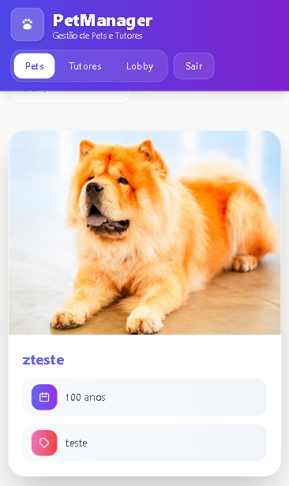
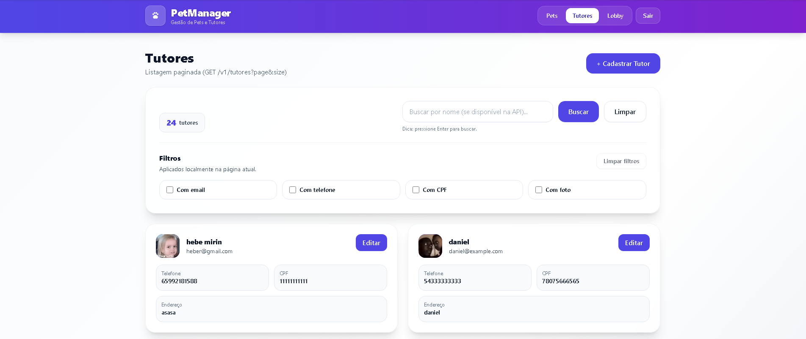
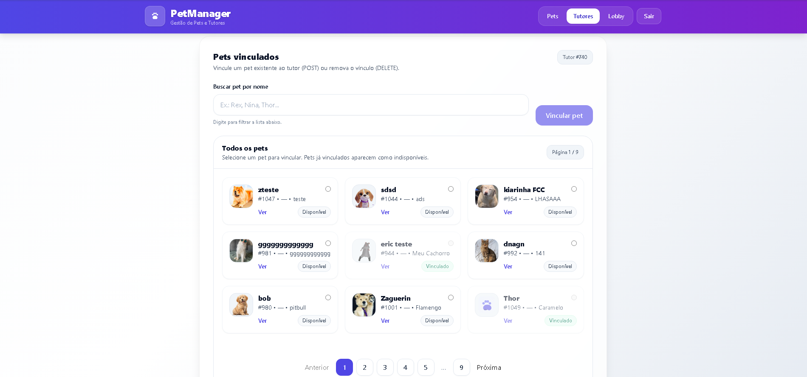

## Autor

**Nome:** José Ricardo Borges Soares da Silva
**Vaga:** Anexo II-B - Projeto Desenvolvedor Front End
**CPF:** 03792486113
**Número da inscrição:** 16576

# PetManager — SEPLAG

Sistema de gestão de pets e tutores para o Estado de Mato Grosso.
SPA em React desenvolvida como parte do processo seletivo para Desenvolvedor Front-End.

A aplicação consome a API pública:
[https://pet-manager-api.geia.vip](https://pet-manager-api.geia.vip)


---

## Visão geral

O projeto implementa uma aplicação completa para cadastro e gerenciamento de pets e tutores, atendendo aos requisitos do edital, incluindo:

* CRUD completo de pets e tutores
* Upload e remoção de imagens
* Vinculação entre pets e tutores
* Autenticação JWT com refresh automático
* Paginação e busca
* Lazy loading das rotas
* Testes unitários
* Containerização com Docker

---

## Imagens da aplicação

### Tela 1 — Listagem de pets


Tela inicial com cards dos pets, busca por nome, filtros e paginação.

---

### Tela 2 — Listagem de pets (responsiva)



Mesma tela em visualização mobile; fotos exibidas inteiras, sem corte.

---

### Tela 3 — Tutores



Listagem de tutores com CRUD, upload de foto e acesso à vinculação de pets.

---

### Tela 4 — Vinculação pet–tutor



Tela para associar um pet a um tutor (incluir e remover vínculos).

---

## Como rodar o projeto

Na raiz do repositório:

```bash
npm install
npm run dev
```

A aplicação iniciará em:

[http://localhost:5173](http://localhost:5173)

Para gerar o build de produção:

```bash
npm run build
```

O resultado será gerado em `dist/`.

Para visualizar o build localmente:

```bash
npm run preview
```

---

## Rodando com Docker

Na pasta do projeto:

```bash
docker build -t petmanager .
docker run -p 8080:80 petmanager
```

Acesse:

[http://localhost:8080](http://localhost:8080)

A imagem utiliza build em dois estágios:

* Node para build
* Nginx para servir os arquivos estáticos

---

## Sobre o .env

O `.env` está versionado propositalmente para facilitar a avaliação, disponibilizando a variável `VITE_API_BASE_URL`.

Em um ambiente de produção, o `.env` não seria versionado, mantendo apenas a documentação das variáveis necessárias.

---

## Tecnologias utilizadas

**Front-end**

* React 19
* TypeScript
* Vite

**Requisições**

* Axios com interceptors para autenticação e refresh de token

**Gerenciamento de estado**

* RxJS (BehaviorSubject)
* Padrão facade
* Hook `useBehaviorSubjectValue`

**Estilo**

* Tailwind CSS
* PostCSS
* Autoprefixer

**Rotas**

* React Router v6
* Lazy loading com React.lazy e Suspense

**Testes**

* Vitest
* Testing Library

**Qualidade de código**

* ESLint
* Tipagem forte com TypeScript

---

## Arquitetura do projeto

A aplicação segue uma arquitetura em camadas:

```
Página → Hook → Store → Service → API
```

Fluxo:

1. A página utiliza um hook da feature
2. O hook consome o store
3. O store executa ações e chama o service
4. O service realiza a requisição HTTP
5. O store atualiza o estado e a UI re-renderiza

Nenhuma página acessa diretamente a API ou services.

---

## Organização de pastas

```
src/
 ├── components
 ├── pages
 ├── services
 ├── state
 ├── context
 ├── utils
 └── types
```

**components**
Componentes reutilizáveis de layout, UI, loading e paginação.

**pages**
Cada módulo possui página, componentes próprios e hooks da feature:

* Pets
* Tutores
* Auth
* Lobby

**services**
Camada de comunicação com a API:

* api.ts
* authService
* petService
* tutorService

**state**
Stores baseadas em BehaviorSubject:

* authStore
* petsListStore
* tutoresListStore
* stores de formulário por instância

**context**

* AuthContext
* ProtectedRoute

**utils**

* Tratamento de erros
* Máscaras
* Filtros
* Adaptadores de resposta
* Eventos de autenticação

---

## Funcionalidades implementadas

### Pets

* Listagem paginada
* Busca por nome
* Filtros locais
* Cadastro e edição
* Upload de foto
* Remoção de foto
* Detalhamento completo
* Exibição responsiva de fotos (foto inteira, sem corte no mobile)

### Tutores

* CRUD completo
* Upload de foto
* Vinculação de pets
* Remoção de vínculo

---

## Autenticação

* Login via JWT
* Refresh automático de token
* Retry automático em requisições
* Logout seguro
* Sincronização entre abas

---

## Testes

Cobertura de:

* Services
* Stores
* Componentes
* Utils

Executar:

```bash
npm test
```

---

## Performance

Otimizações implementadas:

* Lazy loading das rotas
* Cache em memória para consultas individuais
* Paginação server-side
* Pausa de polling em abas inativas

---

## Responsividade (mobile)

Os cards de pets foram pensados para mobile e desktop:

* **Fotos sem corte** — As imagens são exibidas com `object-contain`, garantindo que a foto do pet apareça inteira em qualquer tela, sem recorte nas bordas.
* **Container responsivo** — O bloco da foto usa `aspect-ratio` (4:3) e altura mínima por breakpoint (`min-h-[180px]` no mobile, `sm:min-h-[220px]` no desktop) para manter proporção e evitar “pulo” de layout.
* **Centralização** — Quando a imagem não preenche todo o espaço (por causa do aspect ratio), ela fica centralizada no container com fundo neutro (mesma cor do card), mantendo o visual limpo.

Assim, em telas pequenas o usuário vê a foto completa do pet, e o layout se adapta de forma consistente em diferentes tamanhos de tela.

---

## Containerização

Aplicação empacotada com Docker utilizando build multi-stage:

1. Build com Node
2. Servir com Nginx

Inclui:

* Configuração para SPA
* Health checks
* Dockerignore otimizado

---

## Deploy

A aplicação pode ser publicada em qualquer servidor que suporte containers Docker, como:

* AWS
* Azure
* GCP
* VPS Linux

Basta executar a imagem gerada e expor a porta 80.

---

## Decisões técnicas

Algumas decisões foram tomadas visando simplicidade, escalabilidade e facilidade de manutenção:

* Uso de BehaviorSubject para manter estado reativo sem adicionar bibliotecas pesadas.
* Separação clara entre store, service e UI para reduzir acoplamento.
* Tailwind CSS para acelerar a construção da interface mantendo controle total sobre os componentes.
* Docker multi-stage para reduzir o tamanho final da imagem.

---

## Possíveis melhorias futuras

* Implementar testes E2E
* Implementar cache persistente
* Implementar paginação server-side em todos os endpoints
* Melhorar acessibilidade (ARIA)

---

## Requisitos do edital atendidos

* SPA em React
* Consumo de API em tempo real
* CRUD completo
* Paginação e busca
* Upload de imagens
* Autenticação JWT
* Lazy loading
* Testes unitários
* Gerenciamento de estado avançado
* Containerização

---

## Considerações finais

O projeto foi estruturado priorizando:

* Organização do código
* Separação clara de responsabilidades
* Escalabilidade
* Manutenibilidade
* Performance

A arquitetura adotada permite evolução do projeto com baixo acoplamento entre camadas.

---

